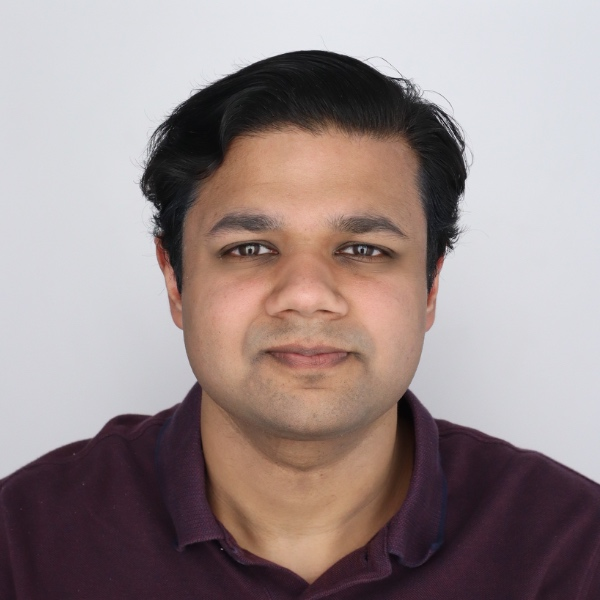

# Raveesh Garg

 

I am currently a PhD student in Electrical and Computer Engineering at [Georgia Institute of Technology](https://www.gatech.edu/). I joined Georgia Tech in Fall 2019 after completing my Bachelor of Engineering in Electronics and Instrumentation Engineering from [Birla Institute of Technology and Science, Pilani](https://www.bits-pilani.ac.in/).

My research focuses on Domain-Specific Accelerators and Mapping for AI, Graph, and HPC Applications. My general research interests include Computer Architecture, Programmable Spatial Accelerators, Domain-Specific Accelerators for AI/HPC, and On-chip Networks.

[CV](Public_CV.pdf) 

## Experience

Research Intern at IBM Research – TJ Watson Center, Yorktown Heights, NY, USA (May 2024 – Aug 2024)

Part-time Student Researcher at Meta Reality Labs; Atlanta, GA, USA (Aug 2022 – Nov 2022)

Research Scientist Intern at Meta Reality Labs; Sunnyvale, CA, USA (May 2022 – Aug 2022)

## Education

 **PhD in Electrical and Computer Engineering** at Georgia Institute of Technology
  - *Advisors*: Dr. Tushar Krishna and Dr. Michael Pellauer
  - *Duration*: 2021 to Present
  - *GPA*: 4/4

 **Master’s in Electrical and Computer Engineering** at Georgia Institute of Technology
  - *Advisor*: Dr. Tushar Krishna
  - *Duration*: 2019 to 2021
  - *Master’s Thesis*: [Understanding the Design Space of Dataflows for Graph Neural Network Accelerators](https://repository.gatech.edu/entities/publication/41a399a8-66ab-4d57-a0fd-e13e06f7ac64)
  - *GPA*: 4/4

 **Bachelor’s in Electronics and Instrumentation Engineering** at Birla Institute of Technology and Science, Pilani
  - *Duration*: 2015 to 2019
  - *GPA*: 9.29/10

## Selected Publications and Pre-prints

[Google Scholar](https://scholar.google.com/citations?hl=en&user=5CKKG44AAAAJ)

#### CELLO: Co-designing Schedule and Hybrid Implicit/Explicit Buffer for Complex Tensor Reuse
*Raveesh Garg*, Michael Pellauer, Sivasankaran Rajamanickam, and Tushar Krishna  
*39th IEEE International Parallel & Distributed Processing Symposium (IPDPS 2025)* [**Accepted for publication**][[ArXiv Link]](https://arxiv.org/pdf/2303.11499)

#### Flexagon: A Multi-Dataflow Sparse-Sparse Matrix Multiplication Accelerator for Efficient DNN Processing
Francisco Muñoz-Martínez, *Raveesh Garg*, Michael Pellauer, José L. Abellán, Manuel E. Acacio, and Tushar Krishna
*28th International Conference on Architectural Support for Programming Languages and Operating Systems (ASPLOS 2023)*  [[Published Paper Link]](https://dl.acm.org/doi/10.1145/3582016.3582069) [[ArXiv Link]](https://arxiv.org/abs/2301.10852)

#### Understanding the Design-Space of Sparse/Dense Multiphase GNN dataflows on Spatial Accelerators
*Raveesh Garg*, Eric Qin, Francisco Muñoz-Martínez, Robert Guirado, Akshay Jain, Sergi Abadal, José L. Abellán, Manuel E. Acacio, Eduard Alarcón, Sivasankaran Rajamanickam, and Tushar Krishna
*36th IEEE International Parallel & Distributed Processing Symposium (IPDPS 2022)*  [[Published Paper Link]](https://ieeexplore.ieee.org/stamp/stamp.jsp?tp=&arnumber=9820725) [[ArXiv Link]](https://arxiv.org/abs/2103.07977)
<b><i>Best Paper Nominee (Top 5 out of 474 submissions)</i></b>

#### HARP: A Taxonomy for Heterogeneous and Hierarchical Processors for Mixed-reuse Workloads
*Raveesh Garg*, Michael Pellauer, and Tushar Krishna
*arXiv preprint arXiv:2502.13113 (2025)*  [[ArXiv Link]](https://arxiv.org/abs/2502.13113)

#### Pipeorgan: Efficient Inter-operation Pipelining with Flexible Spatial Organization and Interconnects
*Raveesh Garg*, Hyoukjun Kwon, Eric Qin, Yu-Hsin Chen, Tushar Krishna, and Liangzhen Lai  
*arXiv preprint arXiv:2405.01736 (2024)*  [[ArXiv Link]](https://arxiv.org/abs/2405.01736)

#### Enabling Flexibility for Sparse Tensor Acceleration via Heterogeneity
Eric Qin, *Raveesh Garg*, Abhimanyu Bambhaniya, Michael Pellauer, Angshuman Parashar, Sivasankaran Rajamanickam, Cong Hao, and Tushar Krishna  
*arXiv preprint arXiv:2201.08916 (2022)*  [[ArXiv Link]](https://arxiv.org/abs/2201.08916)

## Artifacts

**OMEGA**: A simulation Framework for Observing Mapping Efficiency over GNN Accelerators [[GitHub Repository]](http://github.com/stonne-simulator/omega)

## Workshops and Tutorials

**Tutorial (Organizer and Presenter)** at ASPLOS 2023: Enabling Detailed Cycle-Level Simulation of AI and HPC Applications with Detailed Memory Hierarchy using STONNE, OMEGA, and SST-STONNE [[Website]](https://stonne-simulator.github.io/ASPLOSTUT.html)

**Tutorial (Organizer and Presenter)** at ASPLOS 2022: STONNE+OMEGA: Cycle-level Simulation of Dense/Sparse DNN and GNN Accelerators [[Website]](https://stonne-simulator.github.io/ASPLOSTUT.html)

**Young Architect Workshop (Author and Presenter)** at ASPLOS 2022: A Communication-Centric Dataflow Accelerator for High-Performance Conjugate Gradient. [[Lightning Talk]](https://www.youtube.com/watch?v=1DqTIaZZDjI)

**ModSim 2022 (Author and Presenter)**: SST-STONNE: Enabling cycle-level simulation of flexible spatial accelerators for DNNs and GNNs with a detailed memory hierarchy.

## Invited Talks

**Minisymposium** “Co-Design of Data Flow Accelerators for Scientific Simulations and Machine Learning” at SIAM PP’22.
  - *Talk Title*: Understanding the Design Space of Sparse/Dense Multiphase Dataflows for Mapping Graph Neural Networks on Spatial Accelerators
  - [Abstract](https://meetings.siam.org/sess/dsp_talk.cfm?p=119055)

## Awards and Honors

**Best Paper Award Nominee** at IPDPS 2022
  - *Note*: Top 5 from 474 submissions

## Contact

**Email**: raveesh <dot> g <at> gatech <dot> edu
[**LinkedIn**](https://www.linkedin.com/in/raveesh-garg-61b47b150/)

